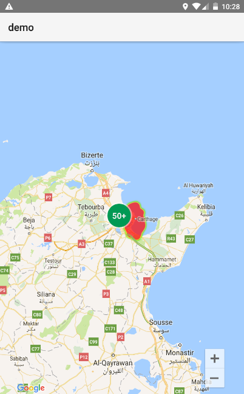
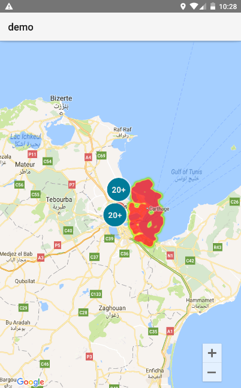
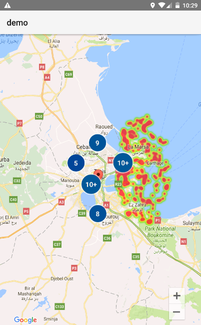
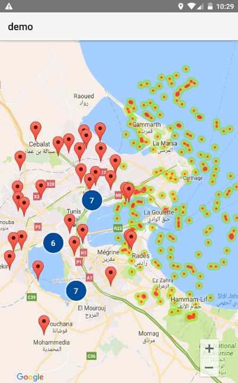

nativescript-google-maps-utils
==================================

NativeScript Google Maps SDK utility library to support features such as marker clustering, heatmap, ...







# State

Android implemented.

iOS not implemented.


## Dependencies

* [nativescript-google-maps-sdk](https://github.com/dapriett/nativescript-google-maps-sdk)
* https://github.com/googlemaps/android-maps-utils
* https://github.com/googlemaps/google-maps-ios-utils

# Install

```
tns plugin add nativescript-google-maps-utils
```

# Usage


```
var GoogleMaps = require('nativescript-google-maps-sdk');
var GoogleMapsUtils = require('nativescript-google-maps-utils');


function onMapReady(args) {

  var mapView = args.object;

	var positionSet = [ /* GoogleMaps.Position... */ ];

	GoogleMapsUtils.setupHeatmap(mapView, positionSet);


	var markerSet = [ /* GoogleMaps.Marker... */ ];

	GoogleMapsUtils.setupMarkerCluster(mapView, makerSet);

}
...

```

## Usage with TypeScript

import using either of

* `import GoogleMapsUtils = require("nativescript-google-maps-utils")`
* `import * as GoogleMapsUtils from "nativescript-google-maps-utils"`

